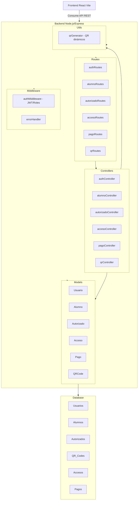

# Arquitectura del Sistema

```mermaid
flowchart TD
    Frontend[Frontend React Vite] -->|Consume API REST| Backend
    
    Backend --> Routes
    Backend --> Controllers
    Backend --> Models
    Backend --> Middleware
    Backend --> Utils
    
    Routes --> Controllers
    Controllers --> Models
    Models --> Database[(MySQL)]
    Controllers --> Utils
    
    subgraph Backend[Backend Node.js/Express]
        subgraph Routes
            authRoutes[authRoutes]
            alumnoRoutes[alumnoRoutes]
            autorizadoRoutes[autorizadoRoutes]
            accesoRoutes[accesoRoutes]
            pagoRoutes[pagoRoutes]
            qrRoutes[qrRoutes]
        end
        
        subgraph Controllers
            authController[authController]
            alumnoController[alumnoController]
            autorizadoController[autorizadoController]
            accesoController[accesoController]
            pagoController[pagoController]
            qrController[qrController]
        end
        
        subgraph Models
            Usuario[Usuario]
            Alumno[Alumno]
            Autorizado[Autorizado]
            Acceso[Acceso]
            Pago[Pago]
            QRCode[QRCode]
        end
        
        subgraph Middleware
            authMiddleware[authMiddleware - JWT/Roles]
            errorHandler[errorHandler]
        end
        
        subgraph Utils
            qrGenerator[qrGenerator - QR dinámicos]
        end
    end
    
    subgraph Database
        Usuarios[Usuarios]
        Alumnos[Alumnos]
        Autorizados[Autorizados]
        QR_Codes[QR_Codes]
        Accesos[Accesos]
        Pagos[Pagos]
    end
```

## Descripción
Sistema de control de acceso con QR dinámicos, gestión de alumnos, autorizados y pagos.
